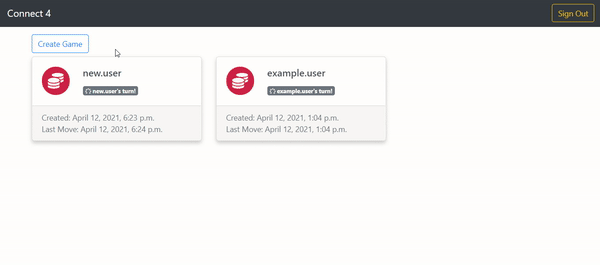

<h3 align="center">
  A django project to play <a href="https://en.wikipedia.org/wiki/Connect_Four">connect four</a> against other users
</h3>
<h4 align="center">
  Demo: https://play-connect-4.herokuapp.com/
</h4>


<h1 align="center">
  <br>
  
  <br>
</h1>


## Local Set Up

This project uses [pipenv](https://pypi.org/project/pipenv/) for requirement management

```bash
pip install pipenv
pipenv install --dev
```

This project also has:
- [black](https://black.readthedocs.io/en/stable/index.html) : a python code formatter
- [isort](https://pycqa.github.io/isort/) : a python import sorter
- [flake8](https://flake8.pycqa.org/en/latest/) : a code style guide enforcer
  
[pre-commit](https://pre-commit.com/) hooks. Which you can install:

```bash
pre-commit install
```

Set up a [postgres](https://www.postgresql.org/download/) db for this project.

Create an environment variable file `config/.env` with the following settings (updated appropriately)

```Shell
DEBUG=True
PRODUCTION=False
SECRET_KEY=foo

DATABASE_NAME=foobar
DATABASE_USER=baz
DATABASE_PASSWORD=qux
DATABASE_PORT=5432
DATABASE_HOST=localhost
```

Then as a django project you can run the commands:

```bash
python manage.py migrate
python manage.py runserver
```

## Contributing
Pull requests are welcome. For major changes, please open an issue first to discuss what you would like to change.

Please make sure to update tests as appropriate and check your code is covered:

```bash
coverage run --source='.' manage.py test games
covergage report
```
